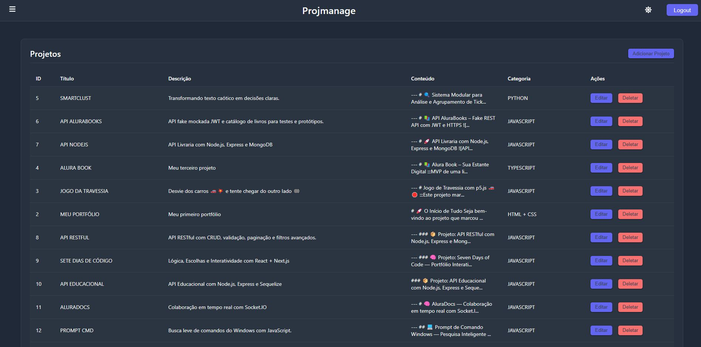
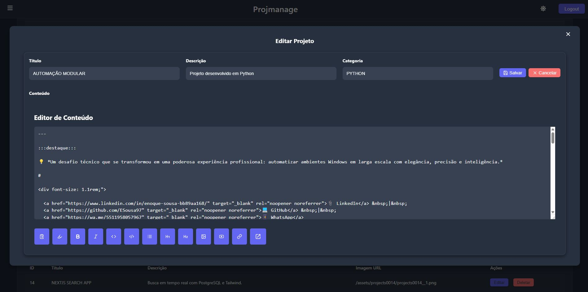
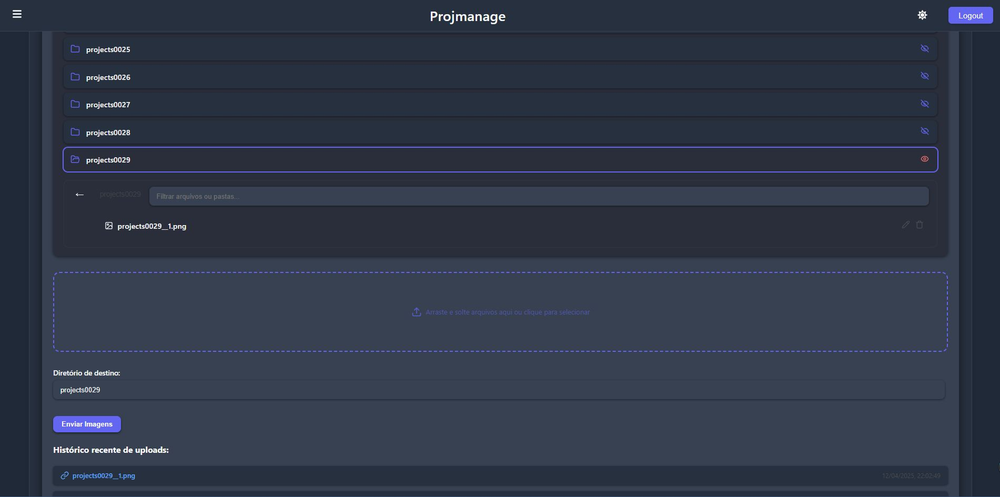
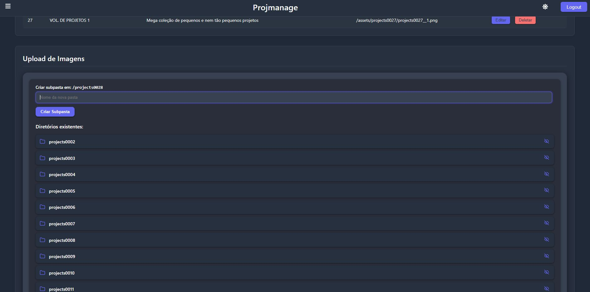
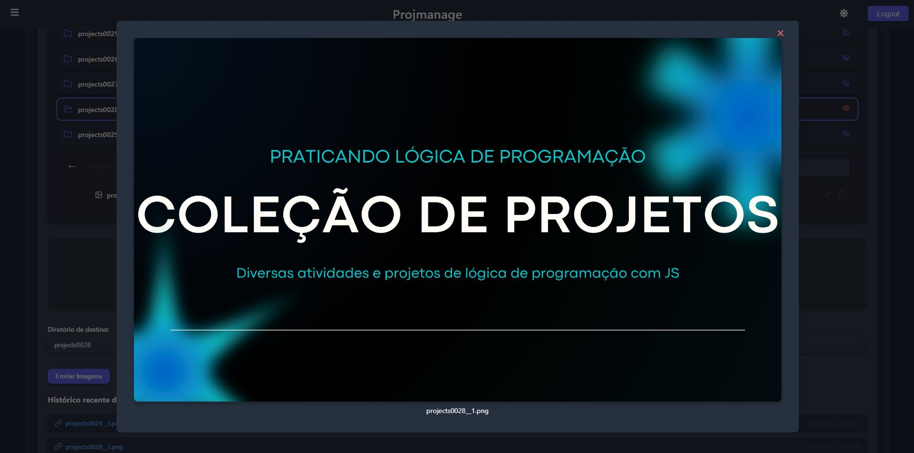
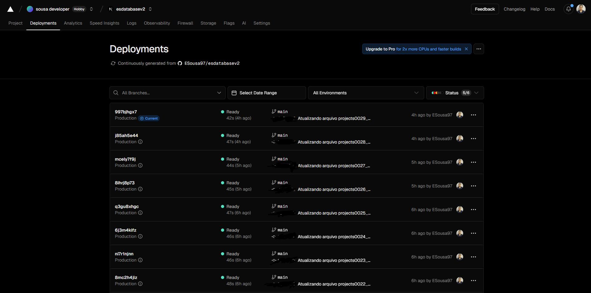
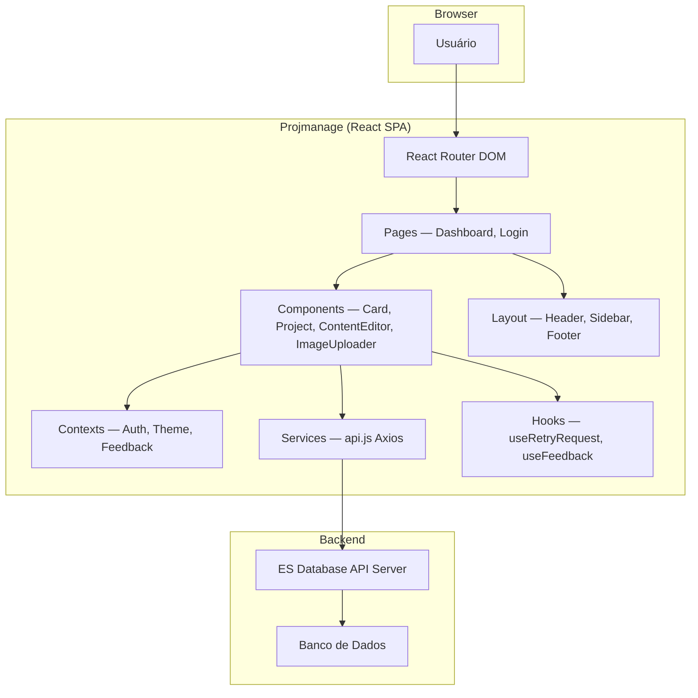

<div align="center">

# Projmanage

[](https://github.com/ESousa97/esdatabasev2/actions/workflows/ci.yml)
[](https://www.codefactor.io/repository/github/esousa97/esdatabasev2)
[](https://opensource.org/licenses/MIT)
[](#)

**Painel administrativo do ecossistema ES Data Base — SPA em React (Create React App) para gerenciamento de Cards, Projetos e ativos de imagem, com editor Markdown com live preview, upload de imagens com gerenciamento hierárquico de diretórios, sincronização automática Card↔Projeto, autenticação via token JWT, tema claro/escuro e comunicação com a [ES Database API](https://github.com/ESousa97/serverdatabase) via Axios.**

</div>

---

> **⚠️ Projeto Arquivado**
> Este projeto não recebe mais atualizações ou correções. O código permanece disponível como referência e pode ser utilizado livremente sob a licença MIT. Fique à vontade para fazer fork caso deseje continuar o desenvolvimento.

---

## Índice

- [Sobre o Projeto](#sobre-o-projeto)
- [Prévia](#prévia)
- [Funcionalidades](#funcionalidades)
- [Tecnologias](#tecnologias)
- [Arquitetura](#arquitetura)
- [Estrutura do Projeto](#estrutura-do-projeto)
- [Começando](#começando)
  - [Pré-requisitos](#pré-requisitos)
  - [Instalação](#instalação)
  - [Configuração](#configuração)
  - [Uso Local](#uso-local)
- [Scripts Disponíveis](#scripts-disponíveis)
- [Endpoints Consumidos](#endpoints-consumidos)
- [FAQ](#faq)
- [Licença](#licença)
- [Contato](#contato)

---

## Sobre o Projeto

Painel administrativo (backoffice) do ecossistema **ES Data Base**, integrado à [ES Database API Server](https://github.com/ESousa97/serverdatabase). Enquanto o [ES Database V2](https://github.com/ESousa97/esdatabasev2) é o frontend público de visualização, o Projmanage é a interface de gestão para criar, editar e organizar todo o conteúdo.

O repositório prioriza:

- **CRUD completo de Cards e Projetos** — Criação, edição e exclusão com sincronização automática entre entidades pareadas (um Card gera um Projeto correspondente e vice-versa)
- **Editor Markdown com live preview** — Textarea com barra de ações (títulos, negrito, itálico, listas, código, links, imagens) e preview em tempo real via `localStorage` em nova aba, usando marked + DOMPurify + highlight.js
- **Sintaxes customizadas** — `@@texto@@` para botões de cópia e `:::texto:::` para blocos de destaque visual, além de embed automático de vídeos do YouTube
- **Gerenciamento de imagens** — Upload drag-and-drop de arquivos PNG, criação/renomeação/exclusão de diretórios hierárquicos, visualização em modal e histórico de uploads recentes
- **Autenticação JWT** — Login com email/senha, tokens de acesso e refresh gerenciados via Context API, rotas protegidas com `PrivateRoute`
- **Tema claro/escuro** — Toggle via header com persistência em CSS variables e `ThemeContext`

---

## Prévia













---

## Funcionalidades

- **Gerenciamento de Cards** — CRUD com título, descrição e URL de imagem; exclusão remove automaticamente o Projeto correspondente
- **Gerenciamento de Projetos** — CRUD com título, descrição, categoria e conteúdo Markdown; exclusão remove automaticamente o Card correspondente
- **Editor Markdown** — Barra de ações com inserção rápida de formatação, syntax highlighting via highlight.js, sanitização com DOMPurify e live preview em nova aba sincronizado via `localStorage`
- **Sintaxes customizadas** — `@@texto@@` cria botões de cópia para clipboard; `:::texto:::` renderiza blocos de destaque visual; URLs do YouTube são automaticamente convertidas em players embed
- **Upload de imagens** — Drag-and-drop de múltiplos arquivos PNG com renomeação pré-upload, seleção de diretório destino e barra de progresso
- **Gerenciamento de diretórios** — Criação, renomeação e exclusão de pastas hierárquicas no servidor; árvore de navegação com visualização de imagens em modal
- **Histórico de uploads** — Registro com URLs e timestamps das imagens enviadas recentemente para referência rápida no editor
- **Autenticação** — Login JWT com tokens de acesso e refresh, rotas protegidas via `PrivateRoute` e Context API
- **Tema claro/escuro** — Toggle via ícone no header com CSS variables e `ThemeContext`
- **Feedback** — Notificações toast via react-toastify encapsuladas em `FeedbackContext` e hook `useFeedback`
- **Retry automático** — Hook `useRetryRequest` para retry de requisições com falha

---

## Tecnologias


**Dependências principais:** react 18, react-router-dom 6, axios, @mui/material, @emotion/react, lucide-react, marked, dompurify, highlight.js, react-toastify, sass.

---

## Arquitetura



### Camadas Principais

| Camada | Responsabilidade |
| --- | --- |
| **Pages** | Dashboard (visão geral), Login, Home |
| **Card** | CardList (CRUD + sync com Project), CardEditor, CardItem |
| **Project** | ProjectList (CRUD + sync com Card), ProjectEditor, ProjectForm, LivePreviewPage |
| **ContentEditor** | Editor Markdown com barra de ações e preview |
| **ImageUploader** | FileUploader, DirectoryManager, DirectoryTreeNode, DirectoryContent, UploadHistory |
| **Layout** | Header (tema + logout), Sidebar (navegação), Footer |
| **Contexts** | AuthContext (JWT), ThemeContext (claro/escuro), FeedbackContext (toasts) |
| **Services** | api.js (Axios com proxy para backend) |

---

## Estrutura do Projeto

```
front-server-esdatabasev2/
├── public/
│   ├── index.html                      # HTML entry point
│   ├── manifest.json                   # PWA manifest
│   ├── projmanager1-6.jpeg             # Screenshots da interface
│   └── favicon.ico
├── src/
│   ├── App.jsx                         # Componente raiz (Contexts + Router)
│   ├── index.js                        # Entry point (ReactDOM.render)
│   ├── components/
│   │   ├── AppRoutes.jsx               # Definição de rotas + PrivateRoute
│   │   ├── PrivateRoute.jsx            # Guard de autenticação
│   │   ├── Auth/
│   │   │   ├── LoginForm.js            # Formulário de login
│   │   │   └── LoginForm.css
│   │   ├── Card/
│   │   │   ├── CardList.jsx            # CRUD de Cards + sync com Projects
│   │   │   ├── CardEditor.jsx          # Editor de Card (título, descrição, imagem)
│   │   │   ├── CardItem.jsx            # Exibição de Card individual
│   │   │   └── CardEditor.css
│   │   ├── Project/
│   │   │   ├── ProjectList.jsx         # CRUD de Projects + sync com Cards
│   │   │   ├── ProjectEditor.jsx       # Editor de Project
│   │   │   ├── ProjectForm.jsx         # Formulário de dados + ContentEditor
│   │   │   ├── ProjectItem.jsx         # Exibição de Project individual
│   │   │   ├── LivePreviewPage.jsx     # Preview Markdown em tempo real
│   │   │   ├── LivePreviewStyles.js    # Estilos do preview
│   │   │   ├── ProjectEditor.css
│   │   │   └── ProjectForm.css
│   │   ├── ContentEditor/
│   │   │   ├── ContentEditor.jsx       # Editor Markdown com textarea + ações
│   │   │   ├── EditorActions.jsx       # Barra de botões de formatação
│   │   │   ├── ContentEditor.css
│   │   │   └── EditorActions.css
│   │   ├── ImageUploader/
│   │   │   ├── FileUploader.jsx        # Drag-and-drop + renomeação pré-upload
│   │   │   ├── DirectoryManager.jsx    # Criação e navegação de diretórios
│   │   │   ├── DirectoryTreeNode.jsx   # Nó da árvore de diretórios
│   │   │   ├── DirectoryContent.jsx    # Conteúdo do diretório selecionado
│   │   │   ├── UploadHistory.jsx       # Histórico de uploads recentes
│   │   │   ├── Feedback.jsx            # Componente de toast
│   │   │   ├── FeedbackContext.js      # Context de feedback
│   │   │   ├── FeedbackProvider.jsx    # Provider do feedback
│   │   │   ├── useFeedback.js          # Hook para toasts
│   │   │   └── icons.js               # Exportação de ícones Lucide
│   │   ├── Layout/
│   │   │   ├── Layout.jsx             # Wrapper com Header + Sidebar + Footer
│   │   │   ├── Header.jsx             # Barra com tema toggle e logout
│   │   │   ├── Sidebar.jsx            # Menu lateral de navegação
│   │   │   ├── Footer.jsx             # Rodapé
│   │   │   ├── Layout.css
│   │   │   ├── Header.css
│   │   │   ├── Sidebar.css
│   │   │   └── Footer.css
│   │   ├── Shared/
│   │   │   ├── ModalEditor.jsx         # Modal reutilizável
│   │   │   ├── ImageModal.jsx          # Modal de visualização de imagem
│   │   │   ├── DirectoryErrorMessage.jsx  # Mensagem de erro de diretório
│   │   │   ├── ModalEditor.css
│   │   │   ├── ImageModal.css
│   │   │   └── DirectoryErrorMessage.css
│   │   ├── style.css                   # Import centralizado de estilos
│   │   └── styles/
│   │       ├── animations.css
│   │       ├── container.css
│   │       ├── drag-drop.css
│   │       ├── feedback.css
│   │       ├── feedback-toast.css
│   │       ├── form.css
│   │       ├── history.css
│   │       ├── preview.css
│   │       ├── progress.css
│   │       └── directory-components/
│   │           ├── directory-actions.css
│   │           ├── directory-content.css
│   │           ├── directory-error.css
│   │           ├── directory-layout.css
│   │           ├── directory-list.css
│   │           ├── directory-manager.css
│   │           ├── directory-tree.css
│   │           └── existing-directories.css
│   ├── contexts/
│   │   ├── AuthContext.js              # Autenticação JWT + tokens
│   │   └── ThemeContext.js             # Toggle claro/escuro
│   ├── hooks/
│   │   └── useRetryRequest.js          # Retry automático de requisições
│   ├── pages/
│   │   ├── DashboardPage.jsx           # Dashboard principal
│   │   ├── DashboardPage.css
│   │   ├── Home.jsx                    # Página home
│   │   ├── Home.css
│   │   └── Login/
│   │       ├── Login.jsx               # Página de login
│   │       └── Login.css
│   ├── services/
│   │   └── api.js                      # Axios instance (proxy → backend)
│   ├── index.css                       # CSS global (variables, resets)
│   └── setupTests.js                   # Config de testes (Jest)
├── package.json
├── .gitignore
├── LICENSE
└── README.md
```

---

## Começando

### Pré-requisitos

```bash
node --version  # v14 ou superior (recomendado v18+)
npm --version   # v6 ou superior
```

### Instalação

```bash
git clone https://github.com/ESousa97/esdatabasev2
cd front-server-esdatabasev2
npm install
```

### Configuração

O projeto usa o proxy do `package.json` para redirecionar chamadas `/api/v1/*` para o backend remoto `https://serverdatabase.onrender.com/api/v1` durante desenvolvimento.

Para apontar para um backend diferente, crie um arquivo `.env` na raiz:

```env
REACT_APP_API_BASE_URL=http://localhost:3001/api/v1
```

### Uso Local

```bash
npm start
```

Acesse: `http://localhost:3000/login`

> O backend [ES Database API](https://github.com/ESousa97/serverdatabase) deve estar ativo para que a aplicação funcione. Por padrão, o proxy aponta para a instância em produção no Render.

---

## Scripts Disponíveis

```bash
# Servidor de desenvolvimento
npm start

# Build de produção (pasta build/)
npm run build

# Testes (Jest + Testing Library)
npm test

# Ejetar configuração do CRA (irreversível)
npm run eject
```

---

## Endpoints Consumidos

O frontend consome a [ES Database API](https://github.com/ESousa97/serverdatabase) (`https://serverdatabase.onrender.com/api/v1`):

| Método | Endpoint | Descrição |
| --- | --- | --- |
| `POST` | `/auth/login` | Autenticação (retorna access + refresh tokens) |
| `GET` | `/cards` | Lista todos os cards |
| `POST` | `/cards` | Cria card (+ projeto correspondente) |
| `PUT` | `/cards/:id` | Atualiza card |
| `DELETE` | `/cards/:id` | Remove card (+ projeto correspondente) |
| `GET` | `/projects` | Lista todos os projetos |
| `POST` | `/projects` | Cria projeto (+ card correspondente) |
| `PUT` | `/projects/:id` | Atualiza projeto |
| `DELETE` | `/projects/:id` | Remove projeto (+ card correspondente) |
| `GET` | `/directories` | Lista diretórios de imagens |
| `GET` | `/directory-content/:path` | Conteúdo de um diretório |
| `POST` | `/create-directory` | Cria diretório |
| `POST` | `/imageupload` | Upload de imagem PNG (FormData) |
| `PUT` | `/rename` | Renomeia arquivo ou diretório |
| `DELETE` | `/delete` | Remove arquivo ou diretório |

---

## FAQ

<details>
<summary><strong>Qual a diferença entre Projmanage e ES Database V2?</strong></summary>

O **ES Database V2** é o frontend público para visualização de projetos e procedimentos (Next.js, SSR, NextAuth). O **Projmanage** é o painel administrativo (React SPA, CRA) para criar, editar e gerenciar todo o conteúdo — cards, projetos, imagens e diretórios. Ambos consomem a mesma API backend.
</details>

<details>
<summary><strong>Como funciona a sincronização Card↔Projeto?</strong></summary>

Ao criar um Card, um Projeto com o mesmo ID é automaticamente criado no backend, e vice-versa. A exclusão de qualquer um remove o par correspondente, garantindo integridade referencial. A lógica está em `CardList.jsx` e `ProjectList.jsx`.
</details>

<details>
<summary><strong>Como funciona o live preview do editor Markdown?</strong></summary>

O `ContentEditor` salva o conteúdo no `localStorage` a cada alteração. O botão "Live Preview" abre `LivePreviewPage` em nova aba, que lê o `localStorage` e renderiza o HTML via marked + DOMPurify + highlight.js, atualizando em tempo real.
</details>

<details>
<summary><strong>Quais formatos de imagem são aceitos no upload?</strong></summary>

Apenas arquivos PNG. O `FileUploader` valida o tipo antes do envio. O upload suporta drag-and-drop de múltiplos arquivos com renomeação individual antes do envio.
</details>

---

## Licença

Este projeto está sob a licença MIT. Veja o arquivo [LICENSE](LICENSE) para mais detalhes.

```
MIT License - você pode usar, copiar, modificar e distribuir este código.
```

---

## Contato

**José Enoque Costa de Sousa**

[](https://www.linkedin.com/in/enoque-sousa-bb89aa168/)
[](https://github.com/ESousa97)
[](https://enoquesousa.vercel.app)

---

<div align="center">

**[⬆ Voltar ao topo](#projmanage)**

Feito com ❤️ por [José Enoque](https://github.com/ESousa97)

**Status do Projeto:** Archived — Sem novas atualizações

</div>
