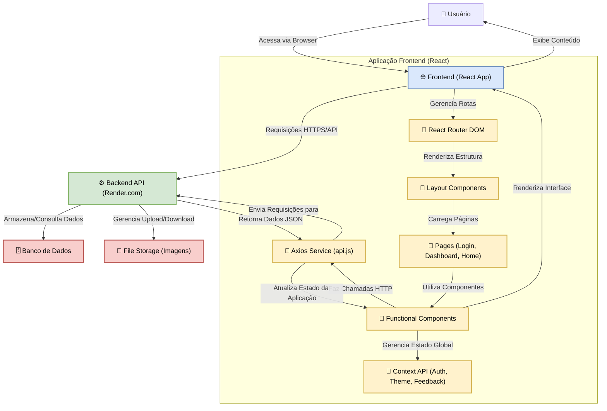

# Projmanage - Sistema Avançado de Gerenciamento de Projetos e Conteúdo Dinâmico

**Slogan Filosófico:** *Orquestrando ideias, catalisando a criação e fomentando a colaboração em projetos através de uma interface intuitiva, enriquecida por recursos avançados de edição e gerenciamento de mídia.*

## Abstract (Resumo Técnico)

Projmanage emerge como uma solução de frontend sofisticada, desenvolvida em React, destinada a otimizar o ciclo de vida de gerenciamento de projetos e seus respectivos conteúdos multimídia. No contexto de aplicações web contemporâneas, onde a agilidade na criação, organização e apresentação de informações é paramount, Projmanage aborda a lacuna existente por ferramentas integradas que combinem gerenciamento de dados estruturados (projetos e cards informativos) com edição de conteúdo rico (Markdown) e um sistema robusto para manipulação de ativos visuais (imagens). A plataforma propõe uma arquitetura componentizada, interagindo com um endpoint de backend (inferido como `https://serverdatabase.onrender.com/api/v1`) para persistência e lógica de negócios. A metodologia central emprega React para a construção da interface do usuário, React Router DOM para navegação, Context API para gerenciamento de estado global (autenticação, temas), e Axios para comunicação com a API RESTful. Funcionalidades chave incluem CRUD completo para "Cards" (representações sumárias) e "Projetos" (conteúdos detalhados), com um mecanismo de sincronização que assegura a criação e remoção coesa de entidades pareadas. Destaca-se um editor de conteúdo Markdown com preview em tempo real, enriquecido com syntax highlighting e sanitização de HTML, e um sistema de upload de imagens com gerenciamento hierárquico de diretórios no servidor. O resultado é uma aplicação web funcional e intuitiva, acessível em [https://esdatabase-projmanage.vercel.app/login](https://esdatabase-projmanage.vercel.app/login), que visa potencializar a produtividade de usuários na gestão de portfólios, documentações técnicas ou qualquer acervo de projetos que demande uma apresentação elaborada e um controle granular de seus componentes.

## Sumário (Table of Contents)

*   [Abstract (Resumo Técnico)](#abstract-resumo-técnico)
*   [Introdução e Motivação](#introdução-e-motivação)
*   [🔗 Link Principal / Acesso ao Projeto](#-link-principal--acesso-ao-projeto)
*   [Arquitetura do Sistema](#arquitetura-do-sistema)
*   [Decisões de Design Chave](#decisões-de-design-chave)
*   [✨ Funcionalidades Detalhadas (com Casos de Uso)](#-funcionalidades-detalhadas-com-casos-de-uso)
*   [🛠️ Tech Stack Detalhado](#️-tech-stack-detalhado)
*   [📂 Estrutura Detalhada do Código-Fonte](#-estrutura-detalhada-do-código-fonte)
*   [📋 Pré-requisitos Avançados](#-pré-requisitos-avançados)
*   [🚀 Guia de Instalação e Configuração Avançada](#-guia-de-instalação-e-configuração-avançada)
*   [⚙️ Uso Avançado e Exemplos](#️-uso-avançado-e-exemplos)
*   [🔧 API Reference (Endpoints Consumidos)](#-api-reference-endpoints-consumidos)
*   [🧪 Estratégia de Testes e Qualidade de Código](#-estratégia-de-testes-e-qualidade-de-código)
*   [🚢 Deployment Detalhado e Escalabilidade](#-deployment-detalhado-e-escalabilidade)
*   [🤝 Contribuição (Nível Avançado)](#-contribuição-nível-avançado)
*   [📜 Licença e Aspectos Legais](#-licença-e-aspectos-legais)
*   [📚 Publicações, Artigos e Citações](#-publicações-artigos-e-citações)
*   [👥 Equipe Principal e Colaboradores Chave](#-equipe-principal-e-colaboradores-chave)
*   [🗺️ Roadmap Detalhado e Visão de Longo Prazo](#️-roadmap-detalhado-e-visão-de-longo-prazo)
*   [❓ FAQ (Perguntas Frequentes)](#-faq-perguntas-frequentes)
*   [📞 Contato e Suporte](#-contato-e-suporte)

## Introdução e Motivação

A gestão eficaz de projetos, especialmente aqueles que envolvem a criação e curadoria de conteúdo digital rico e diversificado, apresenta desafios significativos. Frequentemente, profissionais e equipes recorrem a um conjunto fragmentado de ferramentas para gerenciar diferentes aspectos de seus trabalhos: editores de texto para conteúdo, sistemas de armazenamento em nuvem para mídias, e plataformas de gerenciamento de tarefas para organização. Essa dispersão pode levar a ineficiências, perda de contexto e dificuldades na manutenção da consistência e qualidade do material produzido. Soluções existentes podem ser excessivamente genéricas, não atendendo às necessidades específicas de projetos orientados a conteúdo, ou podem impor custos proibitivos e uma curva de aprendizado íngreme.

Projmanage foi concebido para endereçar essas lacunas, oferecendo uma plataforma unificada e focada, que integra o gerenciamento de "Cards" – entidades visuais e sumárias ideais para visão geral e navegação – e "Projetos" – contêineres para conteúdo detalhado elaborado em Markdown. A proposta de valor central reside na sinergia entre um editor Markdown poderoso, que suporta preview em tempo real e funcionalidades avançadas de formatação, e um gerenciador de imagens robusto, que permite o upload e organização de ativos visuais em uma estrutura de diretórios no servidor. Adicionalmente, o sistema implementa uma lógica de sincronização inteligente: a criação de um Card automaticamente gera um Projeto correspondente (e vice-versa), e a remoção de uma entidade implica na remoção de sua contraparte, garantindo a integridade referencial dos dados.

A motivação principal para o desenvolvimento do Projmanage é empoderar criadores de conteúdo, desenvolvedores, e gestores de projetos, fornecendo-lhes uma ferramenta que simplifica o fluxo de trabalho desde a concepção da ideia até a sua publicação e manutenção. Seja para a construção de portfólios dinâmicos, elaboração de documentações técnicas interativas, criação de bases de conhecimento colaborativas, ou qualquer iniciativa que demande uma apresentação de conteúdo rica e um gerenciamento eficiente de seus componentes, Projmanage visa ser a solução de escolha, promovendo a organização, a criatividade e a produtividade.

## 🔗 Link Principal / Acesso ao Projeto

O Projmanage está disponível para acesso e demonstração através do seguinte link:

*   **[🚀 Acesse o Projmanage (Login)](https://esdatabase-projmanage.vercel.app/login)**

Este link direciona para a página de login da aplicação, onde, após a autenticação, é possível explorar todas as funcionalidades de gerenciamento de cards, projetos, edição de conteúdo e upload de imagens.

## Arquitetura do Sistema

O Projmanage é uma aplicação Single Page Application (SPA) desenvolvida com React, que constitui o frontend do sistema. Ele interage com um backend (hospedado em `https://serverdatabase.onrender.com/api/v1`, conforme o proxy no `package.json`) responsável pela lógica de negócios, autenticação e persistência de dados.

**Componentes Principais:**

1.  **Frontend (Aplicação React Projmanage):**
    *   **Interface do Usuário (UI):** Renderizada no navegador do cliente, construída com componentes React, Material-UI e Emotion para estilização.
    *   **Lógica de Apresentação:** Gerencia a interação do usuário, o estado local dos componentes e a renderização dinâmica do conteúdo.
    *   **Gerenciamento de Estado Global:** Utiliza a Context API do React para gerenciar estados transversais à aplicação, como informações de autenticação (`AuthContext`), tema visual (`ThemeContext`) e feedback ao usuário (`FeedbackContext`).
    *   **Roteamento:** O `react-router-dom` gerencia a navegação entre as diferentes seções (páginas) da aplicação, incluindo a proteção de rotas que exigem autenticação.
    *   **Serviço de API (Axios):** Um wrapper configurado do Axios (`src/services/api.js`) é responsável por todas as comunicações HTTP com o backend.
    *   **Componentes Funcionais:** Inclui módulos específicos para:
        *   Autenticação (`Auth/LoginForm.js`).
        *   Gerenciamento de Cards (`Card/CardList.jsx`, `CardEditor.jsx`).
        *   Gerenciamento de Projetos (`Project/ProjectList.jsx`, `ProjectEditor.jsx`).
        *   Editor de Conteúdo Markdown (`ContentEditor/ContentEditor.jsx`, `LivePreviewPage.jsx`).
        *   Upload e Gerenciamento de Imagens (`ImageUploader/ImageUploader.jsx`, `DirectoryManager.jsx`).
        *   Layout (`Layout/Layout.jsx`, `Header.jsx`, `Sidebar.jsx`).

2.  **Backend API (Servidor Externo):**
    *   **Endpoint:** `https://serverdatabase.onrender.com/api/v1`.
    *   **Responsabilidades:**
        *   Autenticação e autorização de usuários.
        *   Processamento da lógica de negócios (CRUD de Cards e Projetos, sincronização entre eles).
        *   Validação de dados.
        *   Interação com o banco de dados para persistência.
        *   Gerenciamento de arquivos (upload, listagem de diretórios, renomeação, deleção de imagens).

3.  **Banco de Dados (Inferido):**
    *   Utilizado pelo Backend API para armazenar dados de usuários, cards, projetos e metadados de imagens. A tecnologia específica do banco de dados não é visível a partir do frontend.

4.  **Armazenamento de Arquivos (Inferido):**
    *   Utilizado pelo Backend API para armazenar os arquivos de imagem enviados pelos usuários. A infraestrutura de armazenamento (ex: sistema de arquivos do servidor, serviço de storage em nuvem) é gerenciada pelo backend.

**Diagrama de Arquitetura:**



**Decisões Arquiteturais Chave:**

*   **Single Page Application (SPA):** Escolhido para proporcionar uma experiência de usuário fluida e interativa, minimizando recarregamentos de página. React é ideal para SPAs devido ao seu Virtual DOM e arquitetura baseada em componentes.
*   **Comunicação Assíncrona Cliente-Servidor:** A interação com o backend é feita através de chamadas API RESTful assíncronas, permitindo que a UI permaneça responsiva.
*   **Gerenciamento de Estado com Context API:** Para estados globais como autenticação do usuário e preferências de tema, a Context API oferece uma solução integrada ao React, evitando a necessidade de bibliotecas de gerenciamento de estado mais complexas para o escopo atual do projeto.
*   **Componentização:** A UI é dividida em componentes reutilizáveis e coesos, facilitando o desenvolvimento, manutenção e testabilidade.
*   **Backend Dedicado:** A separação clara entre frontend e backend permite especialização e escalabilidade independentes. O frontend foca na apresentação e UX, enquanto o backend lida com a lógica de negócios e dados.

## Decisões de Design Chave

Diversas decisões de design técnico foram tomadas para moldar a funcionalidade e a experiência do Projmanage:

1.  **React como Biblioteca Principal:**
    *   **Justificativa:** React foi escolhido por sua popularidade, vasto ecossistema, modelo de componentização que promove reusabilidade e manutenibilidade, e seu desempenho eficiente devido ao Virtual DOM. Facilita a criação de UIs complexas e interativas.
    *   **Alternativas Consideradas:** Vue.js, Angular. React foi preferido pela familiaridade da equipe e pela disponibilidade de bibliotecas complementares.

2.  **React Router DOM para Roteamento:**
    *   **Justificativa:** Para uma SPA, o roteamento do lado do cliente é essencial. React Router DOM (v6+) oferece uma API declarativa e poderosa para definir rotas, navegação programática, e proteção de rotas.
    *   **Propósito:** Gerenciar a transição entre diferentes "páginas" ou visualizações da aplicação sem recarregar o navegador.

3.  **Axios para Comunicações HTTP:**
    *   **Justificativa:** Axios é um cliente HTTP baseado em Promises popular, que simplifica o envio de requisições assíncronas para o backend. Oferece funcionalidades como interceptadores, transformação de dados e cancelamento de requisições.
    *   **Propósito:** Encapsular a lógica de comunicação com a API backend de forma organizada em `src/services/api.js`.

4.  **Material-UI e Emotion para UI e Estilização:**
    *   **Justificativa:** Material-UI fornece um conjunto rico de componentes React pré-construídos que seguem as diretrizes do Material Design, acelerando o desenvolvimento da UI. Emotion é usado para estilização CSS-in-JS, oferecendo flexibilidade e escopo de estilos.
    *   **Propósito:** Criar uma interface de usuário visualmente agradável, consistente e responsiva com menor esforço de desenvolvimento customizado.

5.  **Processamento de Markdown com `marked`, `DOMPurify` e `highlight.js`:**
    *   **Justificativa:**
        *   `marked`: Biblioteca rápida para converter Markdown em HTML.
        *   `DOMPurify`: Essencial para sanitizar o HTML gerado a partir do Markdown, prevenindo ataques XSS ao renderizar conteúdo de usuário.
        *   `highlight.js`: Para aplicar syntax highlighting em blocos de código dentro do conteúdo Markdown, melhorando a legibilidade.
    *   **Propósito:** Oferecer uma experiência de edição de conteúdo rica e segura, com formatação avançada e visualização de código.

6.  **Ícones com Lucide React e React Icons:**
    *   **Justificativa:** Ambas as bibliotecas oferecem conjuntos abrangentes de ícones SVG de alta qualidade, leves e customizáveis, que são fáceis de integrar em componentes React.
    *   **Propósito:** Melhorar a usabilidade e o apelo visual da interface com ícones consistentes e significativos.

7.  **Notificações com `react-toastify`:**
    *   **Justificativa:** `react-toastify` é uma biblioteca popular para exibir notificações (toasts) de forma simples e configurável.
    *   **Propósito:** Fornecer feedback imediato ao usuário sobre o resultado de suas ações (ex: sucesso ou erro em uploads, salvamento de dados).

8.  **Autenticação Baseada em Token JWT (Inferido):**
    *   **Justificativa:** O armazenamento de `accessToken` e `refreshToken` no `localStorage` (`LoginForm.js`) sugere um fluxo de autenticação baseado em JSON Web Tokens. Este é um padrão comum para SPAs, permitindo comunicação stateless com o backend.
    *   **Propósito:** Proteger o acesso a recursos e funcionalidades da aplicação.

9.  **Sincronização entre Entidades "Card" e "Projeto":**
    *   **Justificativa:** A decisão de criar/deletar automaticamente a entidade correspondente (Projeto ao criar Card, Card ao criar Projeto) visa manter a consistência dos dados e simplificar o fluxo de trabalho do usuário, garantindo que cada "resumo" (Card) tenha um "detalhe" (Projeto) associado e vice-versa.
    *   **Propósito:** Garantir integridade referencial e uma experiência de usuário mais coesa.

10. **Editor de Conteúdo com Live Preview em Nova Aba:**
    *   **Justificativa:** Separar a interface de edição da visualização final em uma nova aba (`LivePreviewPage.jsx`) permite que o usuário veja o resultado renderizado em um contexto limpo, sem a poluição visual das ferramentas de edição. O uso de `localStorage` para passar o conteúdo (`livePreviewContent`) é uma solução simples para comunicação entre abas no mesmo domínio.
    *   **Propósito:** Melhorar a experiência de criação e revisão de conteúdo Markdown.

11. **Gerenciador de Imagens com Estrutura de Diretórios no Servidor:**
    *   **Justificativa:** Permitir que os usuários organizem imagens em diretórios no servidor (`ImageUploader.jsx`, `DirectoryManager.jsx`) oferece maior controle e organização dos ativos de mídia, especialmente em projetos com muitas imagens.
    *   **Propósito:** Facilitar a gestão de um grande volume de imagens de forma estruturada.

## ✨ Funcionalidades Detalhadas (com Casos de Uso)

O Projmanage oferece um conjunto coeso de funcionalidades para gerenciamento de projetos e conteúdo:

1.  **Autenticação de Usuários:**
    *   **Descrição:** Permite que usuários acessem o sistema de forma segura através de um formulário de login (`src/components/Auth/LoginForm.js`). As rotas principais da aplicação são protegidas (`src/components/PrivateRoute.jsx`), exigindo que o usuário esteja autenticado.
    *   **Caso de Uso:** Um usuário acessa a [página de login](https://esdatabase-projmanage.vercel.app/login), insere seu e-mail e senha. Se as credenciais forem válidas, ele é redirecionado para o Dashboard. Caso tente acessar uma rota protegida sem estar logado, é redirecionado para o login.
    *   **Componentes Chave:** `LoginForm.js`, `AuthContext.js`, `PrivateRoute.jsx`.

2.  **Gerenciamento de Cards (CRUD):**
    *   **Descrição:** Os "Cards" são representações sumárias de projetos, contendo título, descrição e uma imagem de capa. O sistema permite criar, visualizar, editar e deletar cards.
    *   **Sincronização:** Ao criar um novo card, um "Projeto" correspondente com o mesmo ID e informações básicas é automaticamente criado no backend. Da mesma forma, ao deletar um card, o projeto associado também é removido.
    *   **Caso de Uso:** No Dashboard, um usuário clica em "Adicionar Card". Preenche o título, descrição e URL da imagem no `CardEditor.jsx`. Ao salvar, o novo card aparece na lista (`CardList.jsx`) e um projeto é criado. O usuário pode então editar ou deletar este card.
    *   **Componentes Chave:** `CardList.jsx`, `CardEditor.jsx`, `CardItem.jsx`.

3.  **Gerenciamento de Projetos (CRUD):**
    *   **Descrição:** Os "Projetos" contêm informações detalhadas, incluindo título, descrição, categoria e um corpo de conteúdo principal em formato Markdown. O sistema permite criar, visualizar, editar e deletar projetos.
    *   **Sincronização:** Ao criar um novo projeto, um "Card" correspondente é automaticamente criado. Ao deletar um projeto, o card associado também é removido.
    *   **Caso de Uso:** Um usuário navega para a seção de gerenciamento de projetos. Utiliza o `ProjectForm.jsx` para criar um novo projeto, definindo título, descrição, categoria e escrevendo o conteúdo Markdown no `ContentEditor.jsx` integrado. Ao salvar, o projeto é listado (`ProjectList.jsx`) e um card associado é gerado.
    *   **Componentes Chave:** `ProjectList.jsx`, `ProjectEditor.jsx`, `ProjectForm.jsx`, `ProjectItem.jsx`.

4.  **Editor de Conteúdo Avançado com Markdown:**
    *   **Descrição:** Integrado ao formulário de projetos, o `ContentEditor.jsx` permite a criação e edição de conteúdo utilizando a sintaxe Markdown. Oferece uma barra de ferramentas (`EditorActions.jsx`) com botões para inserção rápida de elementos comuns (negrito, itálico, listas, títulos, blocos de código, links, imagens de referência, links do YouTube, texto copiável e destaque).
    *   **Live Preview:** O conteúdo sendo editado pode ser visualizado em tempo real em uma nova aba do navegador (`LivePreviewPage.jsx`), que renderiza o Markdown como HTML formatado, incluindo syntax highlighting para código (`highlight.js`) e sanitização (`DOMPurify`).
    *   **Funcionalidades Especiais de Preview:**
        *   **Texto Copiável:** Texto delimitado por `@@texto@@` é renderizado como um botão que, ao ser clicado, copia "texto" para a área de transferência.
        *   **Destaque:** Texto delimitado por `:::texto:::` é renderizado com um estilo de destaque especial.
        *   **Vídeos do YouTube:** Links do YouTube são incorporados com um player interativo, com opção de carregar o vídeo sob demanda e expandir.
    *   **Caso de Uso:** Ao editar um projeto, o usuário utiliza o editor para escrever documentação. Ele insere um bloco de código JavaScript, que é automaticamente destacado. Adiciona um link para um vídeo tutorial do YouTube. Utiliza `@@npm install exemplo@@` para criar um botão de cópia para o comando. Abre o "Live Preview" para verificar a formatação final.
    *   **Componentes Chave:** `ContentEditor.jsx`, `EditorActions.jsx`, `LivePreviewPage.jsx`, `LivePreviewStyles.js`.

5.  **Upload e Gerenciamento de Imagens:**
    *   **Descrição:** Uma seção dedicada (`ImageUploader.jsx`) permite o upload de imagens (formato PNG) para o servidor. As imagens podem ser selecionadas ou arrastadas (drag-and-drop).
    *   **Gerenciamento de Diretórios:** O usuário pode visualizar a estrutura de diretórios de imagens existente no servidor, criar novas subpastas, e selecionar um diretório de destino para os uploads. Permite também renomear e deletar arquivos e pastas no servidor.
    *   **Funcionalidades:** Preview de imagens antes do upload, renomeação de arquivos no cliente, barra de progresso individual por arquivo, histórico de uploads recentes (armazenado no `localStorage`), e um modal para visualização ampliada de imagens selecionadas na árvore de diretórios.
    *   **Caso de Uso:** O usuário acessa a página "Upload de Imagens". Cria uma nova pasta chamada "projeto_alpha". Seleciona múltiplas imagens PNG do seu computador, renomeia algumas delas na interface, e define "projeto_alpha" como destino. Inicia o upload e acompanha o progresso. Posteriormente, navega pela árvore de diretórios para encontrar uma imagem específica e visualizá-la no modal.
    *   **Componentes Chave:** `ImageUploader.jsx`, `FileUploader.jsx`, `DirectoryManager.jsx`, `DirectoryContent.jsx`, `DirectoryTreeNode.jsx`, `UploadHistory.jsx`, `ImageModal.jsx`, `Feedback.jsx`, `FeedbackContext.js`.

6.  **Layout e Navegação Consistentes:**
    *   **Descrição:** A aplicação possui um layout principal (`Layout.jsx`) com um Header fixo (`Header.jsx`), um Sidebar lateral em formato drawer (`Sidebar.jsx`) para navegação, e um Footer (`Footer.jsx`).
    *   **Header:** Contém o título da aplicação, um botão para alternar o Sidebar, um botão para alternar o tema (claro/escuro) e um botão de Logout.
    *   **Sidebar:** Oferece links de navegação para as principais seções (ex: Dashboard).
    *   **Caso de Uso:** O usuário logado vê o Header com seu nome (ou título do app). Clica no ícone de menu para abrir/fechar o Sidebar e navegar para "Upload de Imagens". Clica no ícone de lua/sol para mudar o tema da aplicação.
    *   **Componentes Chave:** `Layout.jsx`, `Header.jsx`, `Sidebar.jsx`, `Footer.jsx`.

7.  **Sistema de Temas (Claro/Escuro):**
    *   **Descrição:** O usuário pode alternar entre um tema visual claro e um escuro. A preferência de tema é gerenciada pelo `ThemeContext.js` e aplicada globalmente.
    *   **Caso de Uso:** No Header, o usuário clica no botão de tema para mudar instantaneamente a aparência da interface entre os modos claro e escuro.
    *   **Componentes Chave:** `ThemeContext.js`, `Header.jsx`.

8.  **Feedback ao Usuário:**
    *   **Descrição:** O sistema utiliza notificações do tipo "toast" (`Feedback.jsx` e `react-toastify`) para informar o usuário sobre o resultado de operações assíncronas, como uploads de imagem, criação/deleção de itens, ou erros.
    *   **Caso de Uso:** Após um upload de imagem bem-sucedido, uma notificação de sucesso aparece no canto da tela. Se ocorrer um erro ao tentar criar um diretório, uma notificação de erro é exibida.
    *   **Componentes Chave:** `Feedback.jsx`, `FeedbackContext.js` (em `src/components/ImageUploader/`), `useFeedback.js`.

## 🛠️ Tech Stack Detalhado

A tabela abaixo detalha as principais tecnologias, bibliotecas e ferramentas utilizadas no desenvolvimento do frontend do Projmanage:

| Categoria             | Tecnologia / Biblioteca        | Versão (do `package.json`) | Propósito no Projeto                                                                                                | Justificativa da Escolha                                                                                                                               |
| --------------------- | ------------------------------ | -------------------------- | ------------------------------------------------------------------------------------------------------------------- | ------------------------------------------------------------------------------------------------------------------------------------------------------ |
| **Frontend Framework**  | React                          | `^18.2.0`                  | Biblioteca principal para construção da interface do usuário e componentização.                                       | Vasto ecossistema, alta performance com Virtual DOM, modelo de componentes reutilizáveis, grande comunidade e suporte.                                |
| **Roteamento**          | React Router DOM               | `^7.4.1`                   | Gerenciamento de navegação e rotas do lado do cliente (SPA).                                                        | Solução padrão para roteamento em aplicações React, API declarativa e flexível, suporte a rotas protegidas.                                          |
| **Gerenciamento de Estado** | React Context API            | N/A (Core do React)        | Gerenciamento de estado global para temas, autenticação e feedback.                                                   | Solução nativa do React, adequada para estados globais de escopo limitado, evitando a complexidade de bibliotecas externas como Redux para este caso. |
| **Comunicação HTTP**  | Axios                          | `^1.8.4`                   | Cliente HTTP para realizar requisições à API backend.                                                               | API baseada em Promises, fácil de usar, interceptadores, tratamento de erros, amplamente adotado.                                                    |
| **UI & Estilização**  | Material-UI (@mui/material)  | `^7.0.1`                   | Biblioteca de componentes React que implementa o Material Design.                                                   | Conjunto rico de componentes pré-estilizados e customizáveis, acelera o desenvolvimento da UI, design consistente.                                 |
| **UI & Estilização**  | Emotion (@emotion/react, @emotion/styled) | `^11.14.0`                 | Biblioteca para estilização CSS-in-JS.                                                                              | Permite escrever CSS diretamente em JavaScript, escopo de estilos, theming dinâmico, integração com Material-UI.                                  |
| **Processamento Markdown** | `marked`                       | `^15.0.7`                  | Converte strings Markdown para HTML.                                                                                | Leve, rápido e extensível, popular na comunidade JavaScript para parsing de Markdown.                                                                 |
| **Segurança (HTML)**    | `DOMPurify`                    | `^3.2.5`                   | Sanitiza HTML para prevenir ataques XSS ao renderizar conteúdo gerado por Markdown.                                   | Essencial para segurança ao lidar com conteúdo de usuário, robusto e confiável.                                                                      |
| **Renderização HTML**   | `html-react-parser`            | `^5.2.3`                   | Converte strings HTML em componentes React.                                                                         | Útil para renderizar o HTML gerado pelo `marked` e `DOMPurify` dentro da árvore de componentes React.                                                |
| **Syntax Highlighting** | `highlight.js`                 | `^11.11.1`                 | Destaca a sintaxe de blocos de código em diversas linguagens.                                                         | Amplo suporte a linguagens, fácil integração, melhora a legibilidade de código em conteúdo Markdown.                                                  |
| **Ícones**              | Lucide React                   | `^0.486.0`                 | Biblioteca de ícones SVG leves e customizáveis.                                                                     | Ícones modernos, consistentes, otimizados para performance, tree-shakable.                                                                           |
| **Ícones**              | React Icons                    | `^5.5.0`                   | Coleção de ícones populares (incluindo Font Awesome, Material Design Icons, etc.) como componentes React.           | Grande variedade de ícones de diferentes sets, fácil de usar.                                                                                          |
| **Notificações (Toasts)** | React Toastify                 | `^11.0.5`                  | Biblioteca para exibir notificações (toasts) ao usuário.                                                            | Fácil de configurar, customizável, oferece boa experiência de usuário para feedback de ações.                                                        |
| **Animações**           | Framer Motion                  | `^12.6.3`                  | Biblioteca para criar animações complexas e interativas em React.                                                     | API poderosa e declarativa para animações, utilizada para transições suaves em modais e outros elementos da UI.                                  |
| **Build & Desenvolvimento** | React Scripts                  | `^5.0.1`                   | Conjunto de scripts e configurações usado pelo Create React App para build, desenvolvimento e testes.                 | Padrão do Create React App, simplifica a configuração inicial do projeto, inclui Webpack, Babel, ESLint.                                            |
| **Linguagem**           | JavaScript (JSX)               | N/A                        | Linguagem principal para desenvolvimento com React.                                                                 | Linguagem padrão para desenvolvimento web frontend, JSX facilita a escrita de componentes React.                                                    |
| **Estilização**         | CSS (global, modules)          | N/A                        | Utilizado para estilização base e específica de componentes, complementando o CSS-in-JS.                              | Flexibilidade para estilos globais e escopados por componente (via arquivos `.css` importados).                                                    |

## 📂 Estrutura Detalhada do Código-Fonte

O projeto `Projmanage` segue uma estrutura de diretórios típica de aplicações criadas com Create React App, com organização modular para componentes, páginas, serviços e contextos.

```
front-server-esdatabasev2-master/
├── .gitignore               # Especifica arquivos e pastas ignorados pelo Git.
├── package-lock.json        # Registra as versões exatas das dependências instaladas.
├── package.json             # Metadados do projeto, dependências e scripts.
├── public/                  # Contém arquivos estáticos e o template HTML principal.
│   ├── favicon.ico          # Ícone da aplicação (aba do navegador).
│   ├── index.html           # Template HTML raiz da SPA.
│   ├── logo192.png          # Logo para PWA (Progressive Web App).
│   ├── logo512.png          # Logo maior para PWA.
│   ├── manifest.json        # Metadados para PWA.
│   └── robots.txt           # Instruções para crawlers de busca.
└── src/                     # Código-fonte principal da aplicação React.
    ├── App.jsx              # Componente raiz da aplicação, configura Providers e Router.
    ├── App.test.js          # Exemplo de teste para o componente App.
    ├── components/          # Diretório para componentes reutilizáveis da UI.
    │   ├── AppRoutes.jsx    # Define as rotas da aplicação.
    │   ├── Auth/            # Componentes relacionados à autenticação.
    │   │   ├── LoginForm.css
    │   │   └── LoginForm.js   # Formulário de login.
    │   ├── Card/            # Componentes para o gerenciamento de "Cards".
    │   │   ├── CardEditor.css
    │   │   ├── CardEditor.jsx # Editor para criar/atualizar Cards.
    │   │   ├── CardItem.jsx   # Representação de um Card individual na lista.
    │   │   └── CardList.jsx   # Lista e gerencia os Cards.
    │   ├── ContentEditor/   # Componentes para o editor de conteúdo Markdown.
    │   │   ├── ContentEditor.css
    │   │   ├── ContentEditor.jsx # O editor Markdown principal.
    │   │   ├── EditorActions.css
    │   │   └── EditorActions.jsx # Barra de ferramentas do editor.
    │   ├── ImageUploader/   # Componentes para o sistema de upload de imagens.
    │   │   ├── DirectoryContent.jsx  # Exibe o conteúdo de um diretório.
    │   │   ├── DirectoryManager.jsx  # Gerencia diretórios (criação, listagem).
    │   │   ├── DirectoryTreeNode.jsx # Nó da árvore de diretórios.
    │   │   ├── Feedback.jsx          # Componente para exibir toasts de feedback.
    │   │   ├── FeedbackContext.js    # Contexto para o sistema de feedback.
    │   │   ├── FeedbackProvider.jsx  # Provider para o FeedbackContext.
    │   │   ├── FileUploader.jsx      # Lida com a seleção e upload de arquivos.
    │   │   ├── UploadHistory.jsx     # Exibe o histórico de uploads.
    │   │   ├── icons.js              # Exporta ícones Lucide utilizados.
    │   │   ├── index.js              # Ponto de entrada para o módulo ImageUploader.
    │   │   └── useFeedback.js        # Hook customizado para usar o FeedbackContext.
    │   ├── ImageUploader.jsx  # Componente principal do sistema de upload. (Nota: Há um diretório e um arquivo com mesmo nome, o arquivo é o agregador)
    │   ├── Layout/            # Componentes estruturais da aplicação (Header, Sidebar, etc.).
    │   │   ├── Footer.css
    │   │   ├── Footer.jsx
    │   │   ├── Header.css
    │   │   ├── Header.jsx
    │   │   ├── Layout.css
    │   │   ├── Layout.jsx     # Componente principal do layout.
    │   │   ├── Sidebar.css
    │   │   └── Sidebar.jsx
    │   ├── PrivateRoute.jsx   # Componente para proteger rotas autenticadas.
    │   ├── Project/           # Componentes para o gerenciamento de "Projetos".
    │   │   ├── LivePreviewPage.jsx # Página para visualização ao vivo do conteúdo Markdown.
    │   │   ├── LivePreviewStyles.js# Estilos (Styled Components) para a LivePreviewPage.
    │   │   ├── ProjectEditor.css
    │   │   ├── ProjectEditor.jsx # Editor para criar/atualizar Projetos.
    │   │   ├── ProjectForm.css
    │   │   ├── ProjectForm.jsx   # Formulário para dados do Projeto, integra ContentEditor.
    │   │   ├── ProjectItem.jsx   # Representação de um Projeto individual na lista.
    │   │   └── ProjectList.jsx   # Lista e gerencia os Projetos.
    │   ├── Shared/            # Componentes compartilhados por diversas partes da aplicação.
    │   │   ├── DirectoryErrorMessage.css
    │   │   ├── DirectoryErrorMessage.jsx # Mensagem de erro para falhas ao carregar diretórios.
    │   │   ├── ImageModal.css
    │   │   ├── ImageModal.jsx    # Modal para visualização de imagens.
    │   │   ├── ModalEditor.css
    │   │   └── ModalEditor.jsx   # Componente base para modais.
    │   ├── style.css          # Importa outros arquivos CSS de componentes.
    │   └── styles/            # Estilos CSS globais/compartilhados para componentes.
    │       ├── animations.css
    │       ├── container.css
    │       ├── directory-components/ # Estilos para componentes do ImageUploader.
    │       ├── drag-drop.css
    │       ├── feedback-toast.css
    │       ├── feedback.css
    │       ├── form.css
    │       ├── history.css
    │       ├── index-directory.css (Não parece estar sendo usado diretamente)
    │       ├── preview.css
    │       └── progress.css
    ├── contexts/            # Contextos React para gerenciamento de estado global.
    │   ├── AuthContext.js     # Contexto para dados de autenticação.
    │   └── ThemeContext.js    # Contexto para o tema da aplicação (light/dark).
    ├── hooks/               # Hooks React customizados.
    │   └── useRetryRequest.js # Hook para tentar novamente requisições falhas.
    ├── index.css            # Estilos CSS globais da aplicação.
    ├── index.js             # Ponto de entrada da aplicação React, renderiza o App.
    ├── logo.svg             # Logo do React (padrão do CRA).
    ├── pages/               # Componentes que representam páginas/rotas principais.
    │   ├── DashboardPage.css
    │   ├── DashboardPage.jsx  # Página principal após o login.
    │   ├── Home.css
    │   ├── Home.jsx           # Página inicial (pode ser a mesma que Dashboard ou outra).
    │   └── Login/             # Componentes da página de Login.
    │       ├── Login.css
    │       └── Login.jsx
    ├── reportWebVitals.js   # Para medição de performance (Web Vitals).
    ├── services/            # Módulos de serviço, como configuração de API.
    │   └── api.js           # Configuração do cliente Axios para chamadas à API.
    └── setupTests.js        # Configuração para testes com Jest.
```

**Filosofia da Estrutura:**

*   **`public/`**: Contém ativos estáticos e o `index.html` que serve como ponto de montagem para a aplicação React.
*   **`src/`**: É o coração da aplicação, onde toda a lógica e componentes React residem.
    *   **`App.jsx`**: Orquestrador principal, configurando contextos globais (autenticação, tema, feedback) e o sistema de roteamento.
    *   **`components/`**: Organizado por funcionalidade (ex: `Auth`, `Card`, `Project`, `ImageUploader`, `Layout`) ou por tipo (ex: `Shared`). Esta abordagem modular facilita a localização, manutenção e reutilização de código.
        *   Cada subdiretório em `components/` geralmente representa uma feature ou um conjunto de componentes relacionados, com seus próprios arquivos CSS para estilização escopada (quando não se usa CSS-in-JS exclusivamente).
    *   **`contexts/`**: Centraliza a lógica de gerenciamento de estado global, tornando-a acessível a qualquer componente que necessite.
    *   **`hooks/`**: Armazena hooks customizados para encapsular lógica reutilizável com estado e ciclo de vida.
    *   **`pages/`**: Define os componentes de nível superior que são mapeados para as rotas da aplicação. Geralmente, compõem-se de vários componentes menores.
    *   **`services/`**: Isola a lógica de comunicação com serviços externos, como a API backend. `api.js` configura o Axios, centralizando a URL base e possíveis interceptadores.
    *   **`styles/` (dentro de `components/`)**: Agrupa arquivos CSS mais genéricos ou temáticos que podem ser aplicados a múltiplos componentes ou definir um estilo visual base.

Essa estrutura promove uma separação clara de responsabilidades, facilitando a escalabilidade e a colaboração no projeto.

## 📋 Pré-requisitos Avançados

Para instalar, configurar e executar o Projmanage localmente, os seguintes pré-requisitos são necessários:

1.  **Node.js:**
    *   Versão: Recomenda-se Node.js `^14.0.0` ou `^16.0.0` ou superior (compatível com `react-scripts^5.0.1`).
    *   Verificação: Execute `node -v` no terminal.
    *   Instalação: Baixe do [site oficial do Node.js](https://nodejs.org/).

2.  **npm (Node Package Manager) ou yarn:**
    *   npm geralmente vem instalado com o Node.js.
    *   Versão npm: Recomenda-se `^6.0.0` ou superior.
    *   Versão yarn (opcional): `^1.22.0` ou superior.
    *   Verificação: `npm -v` ou `yarn -v`.

3.  **Navegador Web Moderno:**
    *   Exemplos: Google Chrome, Mozilla Firefox, Microsoft Edge, Safari (versões recentes).
    *   Necessário para visualizar e interagir com a aplicação.

4.  **Acesso à Internet:**
    *   Necessário para instalar dependências (via npm/yarn) e para que a aplicação frontend se comunique com o backend API hospedado em `https://serverdatabase.onrender.com/api/v1`.

5.  **Git (Opcional, para clonagem):**
    *   Necessário se você for clonar o repositório.
    *   Instalação: Baixe do [site oficial do Git](https://git-scm.com/).

**Configurações de Ambiente Específicas:**

*   O projeto utiliza um proxy configurado no `package.json` para direcionar as chamadas de API em ambiente de desenvolvimento para o backend:
    `"proxy": "https://serverdatabase.onrender.com/api/v1"`
    Isso significa que não são necessárias configurações de variáveis de ambiente no frontend para definir a URL da API, desde que o backend esteja acessível no endereço especificado.

*   Arquivos `.env` são ignorados pelo `.gitignore` (`.env`, `.env.local`, etc.), indicando que configurações sensíveis ou específicas de ambiente (se houver alguma além do proxy) devem ser gerenciadas localmente e não versionadas. Atualmente, com base nos arquivos fornecidos, não parece haver necessidade de um arquivo `.env` para o funcionamento básico do frontend.

## 🚀 Guia de Instalação e Configuração Avançada

Siga os passos abaixo para configurar e executar o Projmanage em seu ambiente de desenvolvimento local:

1.  **Clonar o Repositório (se o código-fonte for obtido via Git):**
    Abra seu terminal ou prompt de comando e execute:
    ```bash
    git clone URL_DO_REPOSITORIO_AQUI projmanage-frontend
    ```
    (Substitua `URL_DO_REPOSITORIO_AQUI` pelo URL real do repositório. Se você baixou o código como .zip, descompacte-o.)

    Navegue até o diretório do projeto:
    ```bash
    cd projmanage-frontend
    ```
    Se você descompactou um arquivo .zip chamado `front-server-esdatabasev2-master`, o comando seria:
    ```bash
    cd front-server-esdatabasev2-master
    ```

2.  **Instalar Dependências:**
    Utilize o npm (ou yarn) para instalar todas as dependências listadas no `package.json`:
    ```bash
    npm install
    ```
    Ou, se preferir usar yarn:
    ```bash
    yarn install
    ```
    Este processo pode levar alguns minutos, dependendo da sua conexão com a internet.

3.  **Configuração de Ambiente:**
    *   **API Backend:** O projeto está configurado para usar um proxy que direciona as chamadas de API para `https://serverdatabase.onrender.com/api/v1` durante o desenvolvimento. Certifique-se de que você tem acesso à internet para que o frontend possa se comunicar com este backend.
    *   **Variáveis de Ambiente Adicionais:** Com base na estrutura fornecida, não parece haver necessidade de configurar arquivos `.env` para o funcionamento básico do frontend. Se, em futuras versões, variáveis de ambiente forem necessárias, você precisaria criar um arquivo `.env` na raiz do projeto (copiando de um `.env.example`, se fornecido) e preencher os valores necessários.

4.  **Iniciar o Servidor de Desenvolvimento:**
    Após a instalação bem-sucedida das dependências, inicie a aplicação em modo de desenvolvimento:
    ```bash
    npm start
    ```
    Ou, com yarn:
    ```bash
    yarn start
    ```
    Este comando iniciará um servidor de desenvolvimento local (geralmente em `http://localhost:3000`) e abrirá automaticamente a aplicação no seu navegador padrão. A aplicação recarregará automaticamente se você fizer alterações nos arquivos de código-fonte.

5.  **Build para Produção (Opcional):**
    Se você precisar gerar uma versão otimizada para produção, execute:
    ```bash
    npm run build
    ```
    Ou, com yarn:
    ```bash
    yarn build
    ```
    Os arquivos da build serão gerados na pasta `build/`. Estes são os arquivos estáticos que podem ser implantados em um servidor web ou plataforma de hospedagem.

**Solução de Problemas Comuns:**

*   **Erros de dependência:** Certifique-se de que o Node.js e o npm/yarn estão instalados corretamente e em versões compatíveis. Tente remover a pasta `node_modules` e o arquivo `package-lock.json` (ou `yarn.lock`) e reinstalar as dependências (`npm install` ou `yarn install`).
*   **Falha ao conectar à API:** Verifique sua conexão com a internet. O backend em `https://serverdatabase.onrender.com/api/v1` precisa estar online e acessível. Verifique o console do navegador para mensagens de erro de rede.
*   **Problemas de porta:** Se a porta `3000` já estiver em uso, o `react-scripts` geralmente perguntará se você deseja usar outra porta.

## ⚙️ Uso Avançado e Exemplos

Projmanage é projetado para ser intuitivo, mas aqui estão alguns exemplos de uso avançado e fluxos de trabalho:

1.  **Fluxo Completo de Criação de Conteúdo (Card + Projeto):**
    *   **Login:** Acesse a aplicação em [https://esdatabase-projmanage.vercel.app/login](https://esdatabase-projmanage.vercel.app/login) e faça login.
    *   **Criar um Card:**
        *   No Dashboard, localize a seção "Gerenciamento de Cards".
        *   Clique para adicionar um novo card. O `CardEditor.jsx` será exibido.
        *   Preencha "Título", "Descrição" e "Imagem (URL)" (ex: `/assets/projects0001/projects0001__2.png` ou use o botão "Preset Imagem").
        *   Clique em "Salvar Card".
        *   *Observação:* Ao salvar o card, um "Projeto" correspondente será automaticamente criado no backend com o mesmo ID e informações básicas.
    *   **Editar o Projeto Associado:**
        *   Navegue até a seção "Gerenciamento de Projetos". O novo projeto (criado automaticamente) deverá estar listado.
        *   Clique em "Editar" no projeto desejado. O `ProjectEditor.jsx` (que inclui o `ProjectForm.jsx`) será aberto.
        *   O título e a descrição podem já estar preenchidos com base no card. Ajuste-os se necessário e defina uma "Categoria".
        *   Utilize o `ContentEditor.jsx` integrado para escrever o conteúdo principal do projeto em Markdown.
            *   **Exemplo de Markdown:**
                ```markdown
                # Título Principal do Projeto

                Este é um parágrafo introdutório.

                ## Subtítulo

                - Item de lista 1
                - Item de lista 2

                ### Código Exemplo
                ```javascript
                function greet(name) {
                  console.log(`Hello, ${name}!`);
                }
                greet('Projmanage User');
                ```

                Link para um vídeo: https://www.youtube.com/watch?v=dQw4w9WgXcQ

                Texto que pode ser copiado: @@Copie este comando: npm install@@

                Texto em destaque: :::Esta informação é muito importante!:::
                ```
        *   Utilize os botões da barra de ferramentas (`EditorActions.jsx`) para inserir rapidamente tags de formatação, links, imagens de referência (ex: ``), etc.
        *   Clique em "Salvar" no `ProjectForm.jsx`.
    *   **Visualizar o Live Preview:**
        *   Dentro do `ContentEditor.jsx` (enquanto edita um projeto), clique no botão "Live Preview" (ícone <MdOpenInNew />).
        *   Uma nova aba do navegador será aberta (`/live-preview`), renderizando o conteúdo Markdown que você está editando.
        *   Verifique a formatação, o syntax highlighting do código, a incorporação do vídeo do YouTube (clique em "Carregar Vídeo"), e o funcionamento dos botões de cópia e texto destacado.
    *   **Adicionar Imagens ao Projeto (via ImageUploader):**
        *   Navegue até a página "Upload de Imagens" (link no Sidebar).
        *   Crie um diretório específico para o seu projeto, se desejar (ex: `meu-projeto-x`) usando o `DirectoryManager.jsx`.
        *   Selecione ou arraste as imagens PNG para a área de upload no `FileUploader.jsx`.
        *   Renomeie os arquivos na interface se necessário.
        *   Certifique-se de que o "Diretório de destino" está correto.
        *   Clique em "Enviar Imagens".
        *   Após o upload, você pode copiar o caminho da imagem (ex: `assets/meu-projeto-x/imagem.png`) do histórico de uploads ou navegando pelos diretórios.
        *   Volte ao editor do projeto e insira a imagem no seu conteúdo Markdown: ``.

2.  **Utilizando o Gerenciador de Diretórios do ImageUploader:**
    *   **Navegação:** Clique em um diretório listado em "Diretórios existentes" para ver seu conteúdo. O caminho do "breadcrumb" será atualizado.
    *   **Criação de Subpastas:** Com um diretório selecionado (ou `assets` como raiz), digite o nome da nova subpasta no campo "Criar subpasta em..." e clique em "Criar Subpasta".
    *   **Filtragem:** Use o campo "Filtrar arquivos ou pastas..." para encontrar rapidamente itens dentro do diretório visualizado.
    *   **Renomear/Deletar:** Cada arquivo ou pasta listado no conteúdo do diretório possui botões para renomear ou deletar. Confirmações podem ser solicitadas.
    *   **Visualizar Imagem:** Clicar em um arquivo de imagem na árvore de diretórios abrirá um modal (`ImageModal.jsx`) com a pré-visualização da imagem.

3.  **Alternância de Tema:**
    *   No Header, clique no ícone de lua (para tema escuro) ou sol (para tema claro) para alternar instantaneamente a aparência visual de toda a aplicação.

Este fluxo demonstra a integração das principais funcionalidades do Projmanage, desde a criação inicial de um item até a edição detalhada de seu conteúdo e o gerenciamento de mídias associadas.

## 🔧 API Reference (Endpoints Consumidos)

O frontend Projmanage consome uma API backend, presumivelmente RESTful, hospedada em `https://serverdatabase.onrender.com/api/v1`. Abaixo estão os principais endpoints que o frontend parece interagir, inferidos a partir da análise do código-fonte (`api.js`, `LoginForm.js`, `CardList.jsx`, `ProjectList.jsx`, `ImageUploader.jsx`):

**Autenticação (`src/components/Auth/LoginForm.js`)**
*   **`POST /auth/login`**
    *   **Descrição:** Autentica um usuário.
    *   **Request Body:** `{ email: "user@example.com", password: "userpassword" }`
    *   **Response Esperada (Sucesso):** `{ accessToken: "jwt_access_token", refreshToken: "jwt_refresh_token" }`

**Gerenciamento de Cards (`src/components/Card/CardList.jsx`)**
*   **`GET /cards`**
    *   **Descrição:** Obtém a lista de todos os cards.
*   **`POST /cards`**
    *   **Descrição:** Cria um novo card.
    *   **Request Body:** `{ titulo: "Título do Card", descricao: "Descrição", imageurl: "/path/to/image.png" }`
*   **`PUT /cards/:id`**
    *   **Descrição:** Atualiza um card existente.
    *   **Request Body:** `{ id: "card_id", titulo: "Novo Título", ... }`
*   **`DELETE /cards/:id`**
    *   **Descrição:** Deleta um card (e o projeto associado).

**Gerenciamento de Projetos (`src/components/Project/ProjectList.jsx`)**
*   **`GET /projects`**
    *   **Descrição:** Obtém a lista de todos os projetos.
*   **`POST /projects`**
    *   **Descrição:** Cria um novo projeto.
    *   **Request Body:** `{ titulo: "Título do Projeto", descricao: "Descrição", conteudo: "Conteúdo Markdown...", categoria: "Categoria" }`
*   **`PUT /projects/:id`**
    *   **Descrição:** Atualiza um projeto existente.
    *   **Request Body:** `{ id: "project_id", titulo: "Novo Título", ... }`
*   **`DELETE /projects/:id`**
    *   **Descrição:** Deleta um projeto (e o card associado).

**Upload e Gerenciamento de Imagens (`src/components/ImageUploader/ImageUploader.jsx`, `DirectoryManager.jsx`, `DirectoryTreeNode.jsx`)**
*   **`POST /imageupload`**
    *   **Descrição:** Realiza o upload de uma imagem.
    *   **Request Body (FormData):**
        *   `image`: Arquivo da imagem.
        *   `directory`: String do diretório de destino (ex: `assets/pasta_projeto`).
        *   `overwrite`: Booleano (true/false).
    *   **Response Esperada (Sucesso):** `{ imageUrl: "url_completa_da_imagem_no_servidor" }`
*   **`GET /directories`**
    *   **Descrição:** Lista os diretórios de imagens existentes no servidor.
    *   **Response Esperada (Sucesso):** `{ directories: ["assets/dir1", "assets/dir2"] }`
*   **`POST /create-directory`**
    *   **Descrição:** Cria um novo diretório no servidor.
    *   **Request Body:** `{ name: "assets/novo_diretorio" }`
*   **`GET /directory-content/:dir`**
    *   **Descrição:** Obtém o conteúdo (arquivos e subdiretórios) de um diretório específico. O parâmetro `:dir` é o caminho do diretório encodado para URL.
    *   **Response Esperada (Sucesso):** `{ content: [{ name: "arquivo.png", type: "file", url: "..." }, { name: "subpasta", type: "dir" }] }`
*   **`POST /rename-item`** (Endpoint inferido para renomeação)
    *   **Descrição:** Renomeia um arquivo ou diretório no servidor.
    *   **Request Body:** `{ oldPath: "caminho/antigo", newName: "novo_nome", type: "file" | "dir" }`
*   **`POST /delete-item`** (Endpoint inferido para deleção)
    *   **Descrição:** Deleta um arquivo ou diretório no servidor.
    *   **Request Body:** `{ path: "caminho/do/item", type: "file" | "dir" }`

**Observação:** A especificação exata dos payloads de request e response, bem como os códigos de status HTTP para cada cenário (sucesso, erro de cliente, erro de servidor), dependeria da documentação da API backend. A lista acima é uma inferência baseada no uso no frontend.

## 🧪 Estratégia de Testes e Qualidade de Código

O projeto Projmanage inclui uma configuração inicial para testes utilizando o ecossistema Jest e React Testing Library, como evidenciado pelo arquivo `src/App.test.js` e as dependências no `package.json` (`@testing-library/jest-dom`, `@testing-library/react`, `@testing-library/user-event`).

**Filosofia e Estratégia de Testes (Sugerida):**

*   **Testes Unitários:** Focar em testar componentes individuais e funções utilitárias de forma isolada. Verificar se os componentes renderizam corretamente dados diferentes props, se os eventos disparam as funções esperadas, e se a lógica interna das funções produz os resultados corretos.
    *   **Ferramentas:** Jest, React Testing Library.
*   **Testes de Integração de Componentes:** Testar a interação entre múltiplos componentes que trabalham juntos para realizar uma funcionalidade (ex: `ProjectForm` com `ContentEditor`).
    *   **Ferramentas:** Jest, React Testing Library.
*   **Testes de Contexto (Context API):** Verificar se os providers de contexto fornecem os valores corretos e se os componentes consumidores reagem adequadamente às mudanças no contexto.
*   **Mocking de API:** Para testes unitários e de integração que envolvem chamadas à API, utilizar mocks (ex: `jest.mock('axios')` ou `msw - Mock Service Worker`) para simular respostas do backend e tornar os testes determinísticos e independentes do estado do servidor real.

**Execução dos Testes:**

*   Para executar a suíte de testes configurada, utilize o comando:
    ```bash
    npm test
    ```
    Ou, com yarn:
    ```bash
    yarn test
    ```
    Isso iniciará o Jest em modo interativo (watch mode), que re-executa os testes automaticamente ao detectar alterações nos arquivos.

**Cobertura de Código:**

*   O Jest pode ser configurado para gerar relatórios de cobertura de código, indicando quais partes do código-fonte são cobertas pelos testes. Para habilitar isso, geralmente se adiciona a flag `--coverage` ao script de teste no `package.json` ou se executa `npm test -- --coverage`.

**Qualidade de Código:**

*   **ESLint:** O projeto está configurado com ESLint (`eslintConfig` no `package.json`, estendendo `react-app` e `react-app/jest`). ESLint ajuda a manter um padrão de código consistente e a identificar potenciais erros ou más práticas.
*   **Prettier (Sugestão):** Para formatação automática de código, a integração com Prettier é altamente recomendada. Isso garante um estilo visual uniforme em todo o projeto.

**CI/CD (Integração Contínua / Entrega Contínua):**

*   Atualmente, não há informações nos arquivos fornecidos sobre a configuração de um pipeline de CI/CD.
*   **Sugestão:** Implementar um pipeline de CI/CD (ex: usando GitHub Actions, GitLab CI, Jenkins) para automatizar:
    *   Execução dos testes a cada push ou pull request.
    *   Verificação de linting e formatação.
    *   Build da aplicação.
    *   Deployment automático para ambientes de staging ou produção após aprovação.

**Desenvolvimento Futuro da Estratégia de Testes:**

*   Aumentar a cobertura de testes unitários para todos os componentes críticos e lógica de negócios no frontend.
*   Implementar testes de integração mais abrangentes para fluxos de usuário chave.
*   Considerar testes End-to-End (E2E) com ferramentas como Cypress ou Playwright para validar a aplicação completa do ponto de vista do usuário, incluindo a interação com o backend real (em um ambiente de teste).

## 🚢 Deployment Detalhado e Escalabilidade

**Plataforma de Deployment Atual:**

O frontend do Projmanage está atualmente implantado e acessível via Vercel, conforme indicado pelo link do projeto: [https://esdatabase-projmanage.vercel.app/login](https://esdatabase-projmanage.vercel.app/login).

**Processo de Deployment (Típico para Vercel com Create React App):**

1.  **Build da Aplicação:**
    O comando `npm run build` (ou `yarn build`) compila a aplicação React, otimizando e agrupando os arquivos JavaScript, CSS e ativos estáticos na pasta `build/`. Esta pasta contém tudo o que é necessário para servir o frontend.

2.  **Configuração na Vercel:**
    *   **Conexão com Repositório Git:** Geralmente, um projeto Vercel é conectado a um repositório Git (GitHub, GitLab, Bitbucket).
    *   **Framework Preset:** Vercel detecta automaticamente que é um projeto Create React App.
    *   **Build Command:** `npm run build` ou `yarn build`.
    *   **Output Directory:** `build`.
    *   **Install Command:** `npm install` ou `yarn install`.
    *   **Variáveis de Ambiente:** Se houver variáveis de ambiente específicas para produção (além do proxy que é para desenvolvimento), elas podem ser configuradas na interface da Vercel.

3.  **Deployments Automáticos:**
    Vercel tipicamente oferece deployments automáticos a cada push para a branch principal (ex: `main` ou `master`) e também cria "preview deployments" para cada pull request, facilitando a revisão de alterações antes do merge.

**Outras Plataformas de Deployment para Frontends Estáticos/SPA:**

O Projmanage, sendo uma SPA construída com React, pode ser implantado em diversas outras plataformas que suportam hospedagem de sites estáticos, como:

*   Netlify
*   GitHub Pages
*   AWS S3 com CloudFront
*   Google Firebase Hosting
*   Azure Static Web Apps

O processo geralmente envolve fazer o build da aplicação e fazer o upload da pasta `build/` para a plataforma escolhida.

**Escalabilidade do Frontend:**

*   **CDN (Content Delivery Network):** Plataformas como Vercel e Netlify utilizam CDNs por padrão. Isso distribui os ativos estáticos da aplicação (HTML, CSS, JS, imagens) por servidores geograficamente próximos aos usuários, reduzindo a latência e melhorando o tempo de carregamento.
*   **Build Otimizado:** O processo de build do Create React App já inclui otimizações como minificação de código, code splitting (divisão do código em chunks menores carregados sob demanda), e hashing de nomes de arquivos para cache busting eficiente.
*   **Escalabilidade Horizontal:** A escalabilidade do frontend em si é gerenciada pela plataforma de hospedagem, que pode lidar com um grande número de requisições para os ativos estáticos.

**Considerações sobre Escalabilidade do Backend:**

*   A escalabilidade do Projmanage como um todo depende crucialmente da capacidade do backend API (`https://serverdatabase.onrender.com/api/v1`) e do banco de dados associado de lidar com o aumento de carga (número de usuários, volume de dados, requisições por segundo).
*   Estratégias de escalabilidade para o backend (não visíveis a partir do frontend) podem incluir:
    *   Escalonamento horizontal (mais instâncias do servidor API).
    *   Escalonamento vertical (servidores mais potentes).
    *   Otimização de queries do banco de dados.
    *   Caching em diferentes níveis (banco de dados, API).
    *   Uso de load balancers.

**Monitoramento e Logging (Frontend):**

*   **Web Vitals:** O `reportWebVitals.js` incluído no projeto pode ser usado para coletar métricas de performance da experiência do usuário (Core Web Vitals) e enviá-las para um serviço de analytics (ex: Google Analytics, Vercel Analytics).
*   **Error Tracking:** Ferramentas como Sentry ou LogRocket podem ser integradas para capturar e reportar erros de JavaScript que ocorrem no navegador dos usuários, facilitando a depuração.
*   **Logging Centralizado:** Para o frontend, o logging é primariamente feito no console do navegador durante o desenvolvimento. Para produção, erros críticos podem ser enviados para serviços de error tracking.

## 🤝 Contribuição (Nível Avançado)

Agradecemos o seu interesse em contribuir para o Projmanage! Para garantir um processo de desenvolvimento colaborativo, eficiente e de alta qualidade, pedimos que siga as diretrizes abaixo.

**Configurando o Ambiente de Desenvolvimento para Contribuição:**

1.  **Fork do Repositório:**
    *   Vá para a página do repositório em `URL_DO_REPOSITORIO_AQUI` (substitua pelo link real).
    *   Clique no botão "Fork" para criar uma cópia do repositório na sua conta.

2.  **Clone do Seu Fork:**
    *   Clone o repositório que você acabou de "forkar" para a sua máquina local:
        ```bash
        git clone URL_DO_SEU_FORK_AQUI projmanage-frontend-dev
        cd projmanage-frontend-dev
        ```

3.  **Adicionar o Repositório Original como "Upstream":**
    *   Isso permite que você mantenha seu fork sincronizado com o projeto original.
        ```bash
        git remote add upstream URL_DO_REPOSITORIO_AQUI
        ```

4.  **Instalar Dependências:**
    *   Conforme a seção [Guia de Instalação](#-guia-de-instalação-e-configuração-avançada):
        ```bash
        npm install
        ```

**Fluxo de Trabalho de Contribuição:**

1.  **Sincronize seu Fork:**
    *   Antes de iniciar qualquer trabalho, certifique-se de que sua branch `main` (ou a branch de desenvolvimento principal) está atualizada com o `upstream`:
        ```bash
        git checkout main
        git fetch upstream
        git merge upstream/main
        git push origin main
        ```

2.  **Crie uma Nova Branch:**
    *   Crie uma branch descritiva para sua feature ou correção de bug a partir da sua branch `main` atualizada:
        ```bash
        git checkout -b nome-da-sua-feature-ou-correcao
        ```
        *Exemplo:* `git checkout -b feat/user-profile-page` ou `git checkout -b fix/login-validation-error`

3.  **Desenvolva sua Contribuição:**
    *   Escreva seu código, seguindo as convenções e guias de estilo do projeto.
    *   Adicione testes unitários e de integração relevantes para suas alterações.
    *   Certifique-se de que todos os testes existentes continuam passando (`npm test`).
    *   Mantenha seus commits atômicos e com mensagens claras.

4.  **Convenções de Commit:**
    *   Recomendamos o uso de [Conventional Commits](https://www.conventionalcommits.org/). Isso ajuda a manter o histórico de commits legível e facilita a geração automática de changelogs.
    *   **Formato:** `<tipo>[escopo opcional]: <descrição>`
        *   `tipo`: `feat` (nova funcionalidade), `fix` (correção de bug), `docs` (mudanças na documentação), `style` (formatação, semântica), `refactor` (refatoração de código sem mudança de comportamento), `test` (adição ou correção de testes), `chore` (manutenção, build).
        *   *Exemplo:* `feat(auth): adicionar funcionalidade de lembrar-me no login`
        *   *Exemplo:* `fix(imageuploader): corrigir erro ao deletar diretório vazio`

5.  **Guia de Estilo de Código:**
    *   O projeto utiliza ESLint para garantir a consistência do código. A configuração está em `package.json` (`eslintConfig`).
    *   Execute `npm run lint` (se o script estiver configurado) ou integre o ESLint ao seu editor para receber feedback em tempo real.
    *   Considere usar Prettier para formatação automática de código.

6.  **Faça Push da sua Branch:**
    *   Após commitar suas alterações localmente, envie-as para o seu fork no GitHub:
        ```bash
        git push origin nome-da-sua-feature-ou-correcao
        ```

7.  **Abra um Pull Request (PR):**
    *   Vá para a página do seu fork no GitHub.
    *   Você verá uma sugestão para criar um Pull Request da sua branch recém-enviada para a branch principal do repositório original (`upstream`).
    *   Clique em "Compare & pull request".
    *   Preencha o template do PR com uma descrição clara das suas alterações, o problema que resolve, e como testar. Se o PR resolve uma Issue existente, mencione-a (ex: `Closes #123`).
    *   O link para abrir Pull Requests no repositório principal é: `URL_DO_REPOSITORIO_AQUI/pulls`.

8.  **Revisão de Código (Code Review):**
    *   Um ou mais mantenedores do projeto revisarão seu PR.
    *   Esteja preparado para discutir suas alterações e fazer ajustes com base no feedback recebido.
    *   Após a aprovação e a passagem de quaisquer verificações de CI, seu PR será mesclado.

**Reportando Bugs e Sugerindo Funcionalidades:**

*   Utilize a seção de **Issues** do repositório (`URL_DO_REPOSITORIO_AQUI/issues`) para:
    *   Reportar bugs detalhadamente, incluindo passos para reproduzir, comportamento esperado e observado, e informações do seu ambiente.
    *   Sugerir novas funcionalidades ou melhorias, explicando o caso de uso e o valor que agregaria.

Agradecemos antecipadamente por suas contribuições!

## 📜 Licença e Aspectos Legais

Atualmente, o projeto Projmanage não possui um arquivo `LICENSE` explícito no código-fonte fornecido.

**Recomendação:**
É crucial que um arquivo de licença (ex: `LICENSE` ou `LICENSE.md`) seja adicionado à raiz do repositório para definir claramente os termos sob os quais o software é distribuído, utilizado e modificado. A escolha da licença (ex: MIT, Apache 2.0, GPLv3) tem implicações significativas para usuários e contribuidores.

**Implicações da Ausência de Licença:**
Sem uma licença explícita, os direitos autorais padrão se aplicam, o que significa que, legalmente, outros podem não ter permissão para usar, copiar, distribuir ou modificar o software. Adicionar uma licença open-source apropriada é fundamental para encorajar a adoção e a colaboração.

**Ação Sugerida:**
Os mantenedores do projeto devem escolher uma licença adequada às suas intenções e adicioná-la ao repositório. Por exemplo, se a intenção é permitir uso e modificação amplos com poucas restrições, a Licença MIT é uma escolha popular.

## 📚 Publicações, Artigos e Citações

Não aplicável a este projeto neste momento. O Projmanage, com base nas informações fornecidas, parece ser um projeto de desenvolvimento de software prático e não diretamente vinculado a publicações acadêmicas ou científicas.

## 👥 Equipe Principal e Colaboradores Chave

Com base nas informações disponíveis nos arquivos do projeto:

*   **Desenvolvedor Principal / Contato:**
    *   **José Enoque** (Mencionado no `src/components/Layout/Footer.jsx` como desenvolvedor).

Informações adicionais sobre outros contribuidores ou links para perfis profissionais (GitHub, LinkedIn) não foram fornecidas no contexto desta análise.

Se você é um colaborador chave e gostaria de ser listado aqui, por favor, entre em contato com os mantenedores do projeto ou abra um Pull Request para atualizar esta seção.

## 🗺️ Roadmap Detalhado e Visão de Longo Prazo

Este é um roadmap sugerido, baseado nas funcionalidades atuais e possíveis evoluções para o Projmanage.

**Curto Prazo (Próximos 1-3 meses):**

1.  **📄 Adição de Licença:**
    *   Definir e adicionar um arquivo `LICENSE` ao repositório (ex: MIT, Apache 2.0).
2.  **🧪 Melhoria da Cobertura de Testes:**
    *   Aumentar a cobertura de testes unitários para componentes críticos (ex: `ContentEditor`, `ImageUploader`, lógica de CRUD em `CardList` e `ProjectList`).
    *   Implementar testes de integração para fluxos chave (ex: login, criação completa de card/projeto).
3.  **📖 Documentação da API Backend:**
    *   Embora o frontend consuma a API, ter uma documentação clara da API backend (Swagger/OpenAPI) seria benéfico para desenvolvedores frontend e para a manutenção geral. Se o backend for parte do mesmo esforço de desenvolvimento, priorizar sua documentação.
4.  **🎨 Refinamentos na UI/UX:**
    *   Coletar feedback dos primeiros usuários e realizar pequenos ajustes na interface para melhorar a usabilidade e a experiência visual.
    *   Melhorar o tratamento de estados de carregamento e erro em mais componentes.
5.  **🧩 Internacionalização (i18n) - Preparação:**
    *   Estruturar o código para facilitar a futura adição de múltiplos idiomas (ex: extrair strings para arquivos de tradução).

**Médio Prazo (Próximos 3-9 meses):**

1.  **✨ Funcionalidades Avançadas no Editor de Conteúdo:**
    *   Suporte para tabelas Markdown.
    *   Possibilidade de embutir outros tipos de mídia (ex: Gists, CodePen).
    *   Upload de imagens diretamente do editor de conteúdo.
2.  **👥 Perfis de Usuário e Permissões (se aplicável ao backend):**
    *   Se o sistema evoluir para múltiplos usuários com diferentes níveis de acesso, implementar funcionalidades de perfil e gerenciamento de permissões.
3.  **🏷️ Sistema de Tags/Categorias Aprimorado:**
    *   Melhorar a forma como categorias ou tags são gerenciadas para projetos, permitindo filtragem e busca mais robustas.
4.  **🚀 Otimizações de Performance:**
    *   Analisar e otimizar o carregamento de listas grandes de cards/projetos (virtualização de listas, paginação no backend).
    *   Otimizar o carregamento de imagens.
5.  **🌐 Internacionalização (i18n) - Implementação:**
    *   Adicionar suporte para pelo menos um segundo idioma (ex: Inglês).

**Longo Prazo (9+ meses / Visão Futura):**

1.  **🤝 Colaboração em Tempo Real:**
    *   Explorar a possibilidade de múltiplos usuários editarem o mesmo projeto/documento simultaneamente (requer mudanças significativas no backend e uso de tecnologias como WebSockets).
2.  **🔄 Versionamento de Conteúdo:**
    *   Permitir que os usuários revertam para versões anteriores do conteúdo de um projeto.
3.  **📊 Analytics e Relatórios:**
    *   Fornecer aos usuários dados sobre a visualização ou engajamento com seus projetos/cards (se aplicável ao propósito do sistema).
4.  **🔌 Integração com Terceiros / API Pública:**
    *   Expor uma API pública para que outros sistemas possam interagir com o Projmanage.
    *   Integrar com outras ferramentas populares de produtividade ou armazenamento.
5.  **📱 Melhorias na Experiência Mobile:**
    *   Garantir que todas as funcionalidades sejam perfeitamente utilizáveis em dispositivos móveis, possivelmente com um design responsivo mais adaptado ou até mesmo um PWA mais robusto.

**Desafios Técnicos e de Produto Antecipados:**

*   **Escalabilidade do Backend:** À medida que o número de usuários e o volume de dados crescem, o backend precisará ser dimensionado adequadamente.
*   **Gerenciamento de Mídia em Larga Escala:** O armazenamento e a entrega eficiente de um grande volume de imagens podem se tornar um desafio.
*   **Complexidade da Interface:** Adicionar novas funcionalidades sem sobrecarregar a interface do usuário e manter a intuitividade.
*   **Segurança:** Manter a aplicação segura contra vulnerabilidades, especialmente no que tange ao upload de arquivos e renderização de conteúdo.

Esta visão de roadmap é dinâmica e deve ser reavaliada periodicamente com base no feedback dos usuários e nas prioridades do projeto.

## ❓ FAQ (Perguntas Frequentes)

1.  **P: Onde os dados dos meus Cards e Projetos são armazenados?**
    *   R: Todos os dados de Cards, Projetos, conteúdo Markdown e metadados de imagens são armazenados no servidor backend, que utiliza um banco de dados para persistência. O frontend Projmanage apenas interage com este backend para buscar e enviar dados.

2.  **P: Preciso configurar um backend para usar o Projmanage localmente?**
    *   R: Para o funcionamento completo, sim. O frontend está configurado para se comunicar com um backend existente em `https://serverdatabase.onrender.com/api/v1`. Se você estiver executando o frontend localmente, ele tentará se conectar a este backend remoto. Se você deseja executar todo o sistema localmente, precisaria também do código-fonte e das instruções de configuração do backend.

3.  **P: Quais formatos de imagem são suportados para upload?**
    *   R: Atualmente, o `FileUploader.jsx` está configurado para aceitar apenas arquivos no formato `.png` (`accept=".png"`).

4.  **P: Posso usar imagens de URLs externas nos meus Cards ou Projetos, ou preciso sempre fazer upload?**
    *   R: Para o campo "Imagem (URL)" do Card (`CardEditor.jsx`), você pode fornecer um caminho relativo para uma imagem que já exista no servidor (ex: após upload pelo `ImageUploader`) ou, teoricamente, uma URL absoluta de uma imagem externa. No conteúdo Markdown dos Projetos, você pode referenciar imagens usando a sintaxe `` para imagens no mesmo servidor (gerenciadas pelo `ImageUploader`) ou `` para imagens externas.

5.  **P: O conteúdo Markdown que eu edito é salvo automaticamente?**
    *   R: O `ContentEditor.jsx` atualiza o estado do formulário (`ProjectForm.jsx`) à medida que você digita. Para persistir as alterações no servidor, você precisa clicar no botão "Salvar" do formulário do projeto. O conteúdo também é salvo no `localStorage` do navegador (`livePreviewContent`) para permitir a funcionalidade de "Live Preview" em outra aba.

6.  **P: Como funciona o sistema de temas (claro/escuro)?**
    *   R: O Projmanage utiliza a Context API do React (`ThemeContext.js`) para gerenciar o tema atual. Um botão no Header permite alternar entre os temas. As variáveis CSS correspondentes ao tema selecionado são aplicadas globalmente para mudar a aparência da aplicação.

7.  **P: Onde posso encontrar os ícones utilizados na aplicação?**
    *   R: A aplicação utiliza ícones das bibliotecas `lucide-react` e `react-icons`. Alguns ícones específicos do `ImageUploader` são centralizados em `src/components/ImageUploader/icons.js`.

8.  **P: Como reportar um bug ou sugerir uma nova funcionalidade?**
    *   R: Por favor, utilize a seção de "Issues" do repositório GitHub do projeto (link a ser fornecido pelos mantenedores, geralmente `URL_DO_REPOSITORIO_AQUI/issues`).

## 📞 Contato e Suporte

Para questões gerais, reporte de bugs, sugestões de funcionalidades ou discussões sobre o projeto Projmanage, utilize os seguintes canais:

*   **Issues do Repositório GitHub:**
    *   Este é o canal preferencial para reportar bugs detalhados e sugerir novas funcionalidades. Por favor, verifique se já existe uma issue similar antes de criar uma nova.
    *   Link: `URL_DO_REPOSITORIO_AQUI/issues` (Substitua `URL_DO_REPOSITORIO_AQUI` pelo link real do repositório quando disponível).

*   **Contato com o Desenvolvedor:**
    *   Para questões que não se encaixam no formato de uma issue pública, você pode tentar entrar em contato com **José Enoque**, mencionado como o desenvolvedor do projeto. (Meios de contato específicos não foram fornecidos).

Por favor, forneça o máximo de detalhes possível ao reportar problemas, incluindo passos para reproduzir o erro, versões de software utilizadas e capturas de tela, se aplicável. Isso nos ajudará a entender e resolver o problema mais rapidamente.
